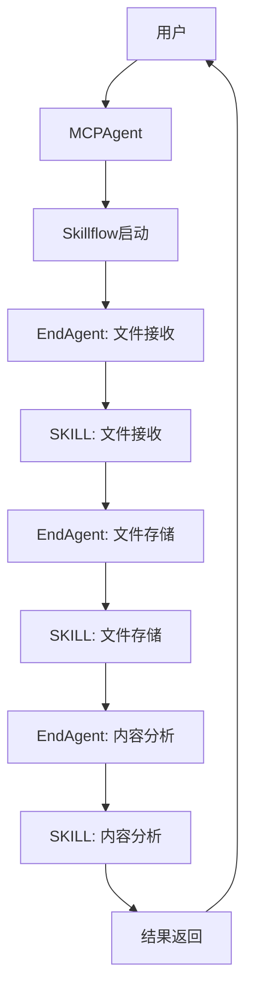
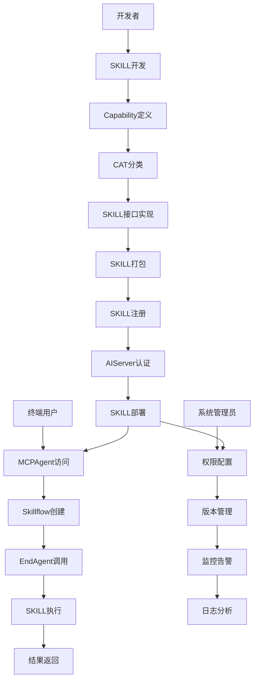
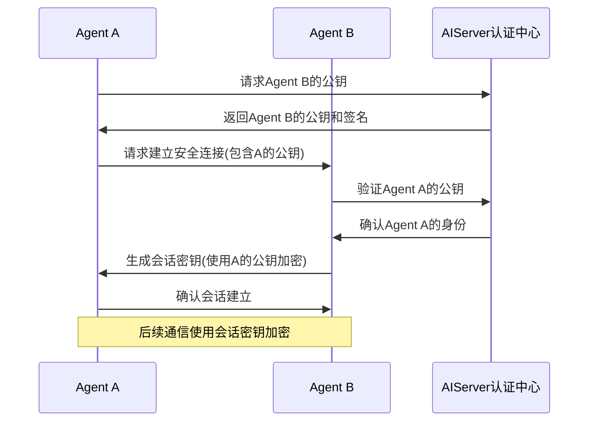
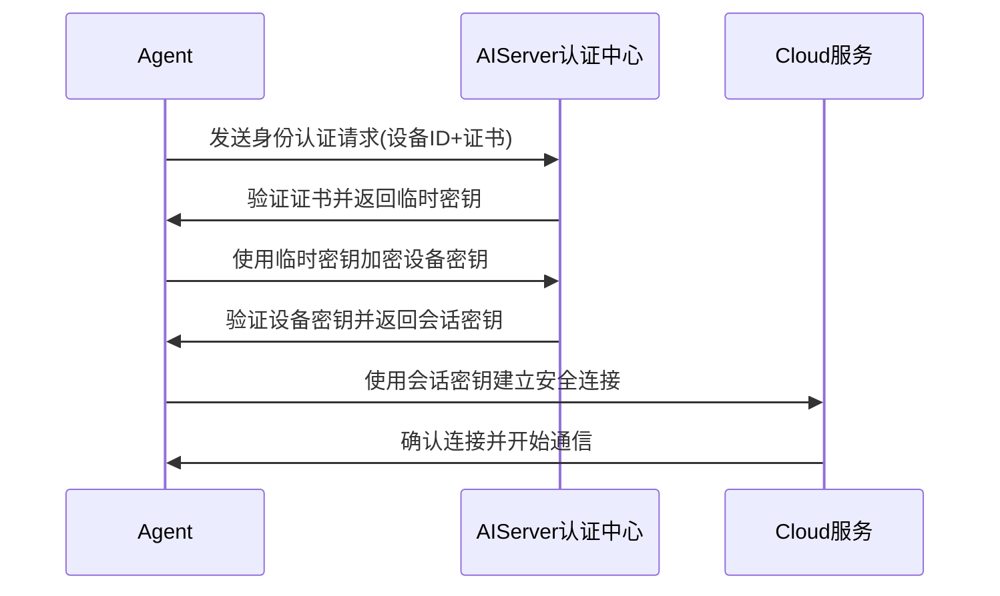
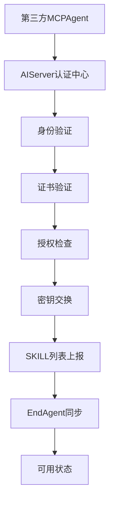

# SuperAgent术语文档

## 文档版本
0.51

## 1. 总体介绍

### 1.1 企业部署必要性

在数字化转型的浪潮中，Agent技术正逐步成为企业业务系统的标配。SuperAgent作为新一代的Agent框架，为企业提供了安全、灵活、高效的业务集成和自动化解决方案。企业部署SuperAgent的必要性主要体现在以下几个方面：

1. **业务系统集成需求**：现代企业通常拥有多个独立的业务系统，SuperAgent提供了统一的集成框架，实现系统间的无缝连接和数据共享。

2. **SKILL开发便捷高效**：SuperAgent的SKILL开发框架简化了开发流程，支持快速构建和部署各类业务功能模块，大幅降低了开发成本和时间。

3. **开源SKILL生态繁荣**：随着开源SKILL的爆炸性增长，企业可以直接利用丰富的开源资源，加速业务创新和数字化转型。

4. **安全合规要求**：SuperAgent提供了完善的安全机制，包括身份认证、权限控制、数据加密等，帮助企业满足严格的安全合规要求。

5. **系统扩展性和灵活性**：SuperAgent的模块化设计和松耦合架构支持企业根据业务需求灵活扩展系统功能，快速响应市场变化。

6. **成本效益优化**：通过SuperAgent的自动化和集成能力，企业可以减少人工干预，提高运营效率，降低整体IT成本。

如何安全、规范地搭建和管理Agent系统，成为企业数字化转型的关键。本术语表旨在为企业提供统一的SuperAgent术语体系，确保系统开发、部署和使用过程中的一致性和规范性。

### 1.2 文档目的

本文档定义了SuperAgent系统的核心术语，旨在确保所有用户、开发者和系统管理员对SuperAgent的概念、组件和功能有统一的理解，促进系统开发、部署和使用过程中的有效沟通。

### 1.3 术语范围

本术语表涵盖SuperAgent系统的核心概念、扩展组件、设计原则和文档规范等相关术语，不包含IoT领域的专业术语。

### 1.4 术语分类

SuperAgent术语分为四大类：
- **核心概念术语**：系统的基本构建块和核心功能
- **扩展概念术语**：支持系统运行的辅助功能和组件
- **设计原则术语**：指导系统设计和开发的基本原则
- **文档规范术语**：系统开发和使用过程中的规范和指南

## 2. 术语列表

### 2.1 核心概念术语

| 术语 | 英文全称 | 简称 | 描述 | 场景使用 |
|------|----------|------|------|----------|
| **用户** | User | - | 系统的使用者，可以是个人或组织 | 作为系统的最终使用者，通过MCPAgent访问和使用SKILL |
| **角色** | Role | - | 用户在系统中扮演的角色，决定了操作权限 | 区分个人用户、公司经理、项目经理、普通员工等不同角色，实现权限控制 |
| **MCPAgent** | Master Control Point Agent | MCP | 服务流入口，管理和协调其他Agent，用户可以拥有多个 | 作为用户访问入口，管理EndAgent和Skillflow，支持个人私有、公司所有和项目所有三种类型 |
| **RouteAgent** | Route Agent | Route | 负责桥接和转发，连接MCPAgent和EndAgent | 在MCPAgent和EndAgent之间建立通信桥梁，支持复杂网络拓扑 |
| **EndAgent** | End Agent | End | 独立功能模块，执行具体任务 | 调用SKILL执行具体功能，如文件接收、存储、分析等 |
| **SKILL** | SKILL | - | 物理程序，具有唯一标识，可被管理和控制，提供特定功能 | 提供具体业务功能实现，如文件分析、数据处理等 |
| **能力** | Capability | cap | SKILL提供的具体功能，由SKILL开发者静态定义，支持1:n关系 | 定义SKILL的细粒度功能，支持权限控制和功能发现 |
| **能力类型** | Capability And Type | CAT | 能力的分类方式，用于SKILL能力的组织和发现 | 对Capability进行分类管理，便于用户查找和使用 |
| **SKILL接口** | SKILL Interface | - | SKILL的对外访问点，映射到具体的Capability | 提供标准化的访问方式，支持不同系统的集成调用 |
| **Skillflow** | Skillflow | - | 多个Agent协作完成的服务流程，定义了执行步骤和逻辑 | 编排多个EndAgent和SKILL，实现复杂业务流程 |
| **Agent注册中心** | Agent Registry | - | 管理所有Agent的注册、发现和状态 | 维护Agent的注册信息，支持Agent的发现和状态管理 |
| **SKILL注册中心** | SKILL Registry | - | 管理所有SKILL的注册、分类和状态 | 维护SKILL的注册信息，支持SKILL的发现和版本管理 |
| **AIServer认证中心** | AIServer Authentication Center | - | 负责SKILL的认证、Cat功能注册和密钥管理 | 提供身份认证、密钥管理和安全控制服务 |
| **认证中心** | Auth Authentication Center | Auth | 负责系统的认证和授权管理，包括用户认证、设备认证、权限管理等 | 确保系统的安全访问和权限控制 |
| **数据中心** | DataServer | - | 管理系统的所有数据，包括配置数据、状态数据、历史数据等 | 提供系统数据的存储、查询和管理服务 |
| **SKILL能力管理中心** | SKILL Capability Management Center | - | 管理所有SKILL的注册、分类、发现和状态监控，支持SKILL的1:n Capability关系定义 | 集中管理SKILL的能力和状态 |
| **LLM调度中心** | LLM Scheduling Center | - | 负责大语言模型的调度和管理，包括模型选择、请求分发、响应处理等 | 提供大语言模型的统一调度和管理服务 |
| **Skillflow调度中心** | Skillflow Scheduling Center | - | 管理服务流的定义、执行和监控，包括服务流的解析、步骤调度、状态管理等 | 提供Skillflow的统一调度和管理服务 |
| **Cat功能** | Cat Function | - | 已废弃，统一使用Capability表示SKILL提供的具体功能 | 历史术语，已被Capability替代 |
| **空间** | Space | - | 资源的容器单元，用于组织和管理Zone，允许嵌套，支持权限隔离和资源配额 | 组织和管理SKILL部署环境 |
| **区域** | Zone | - | 资源的原子部署单元，直接承载SKILL实例，不可嵌套，具有明确的资源边界，支持资源隔离和监控 | 部署和运行SKILL的物理或虚拟环境 |

### 2.2 扩展概念术语

| 术语 | 英文全称 | 简称 | 描述 | 场景使用 |
|------|----------|------|------|----------|
| **SKILL部署环境** | SKILL Deployment Environment | - | SKILL的运行环境，如个人PC、服务器、边缘设备等 | 部署SKILL到不同环境，满足不同的性能和安全需求 |
| **Endpoint** | Endpoint | - | 网络通信的端点，由协议、主机、端口和路径组成，用于访问SKILL接口 | 提供网络访问地址，支持远程调用SKILL功能 |
| **端口** | Port | - | 网络通信的端口号，用于区分同一主机上的不同服务 | 配置SKILL的网络访问端口，确保服务可访问性 |
| **版本管理** | Version Management | - | 管理SKILL和Capability的版本，确保兼容性 | 跟踪SKILL版本变化，支持版本回滚和升级管理 |
| **权限控制** | Access Control | - | 基于角色的访问控制（RBAC），管理用户对资源的访问权限 | 控制用户对SKILL和Capability的访问权限，确保数据安全 |
| **MCP Mesh** | MCP Mesh Network | - | MCPAgent的Mesh组网，提高系统可用性和扩展性 | 构建高可用的MCPAgent网络，提高系统可靠性 |
| **密钥交换** | Key Exchange | - | 组件间的安全密钥交换机制，确保通信安全 | 在Agent之间和Agent与云服务之间建立安全通信通道 |
| **证书认证** | Certificate Authentication | - | 使用数字证书进行身份验证 | 验证Agent和用户的身份，确保通信双方的真实性 |
| **会话密钥** | Session Key | - | 临时密钥，用于加密会话期间的通信 | 加密Agent之间和Agent与云服务之间的会话数据 |
| **设备密钥** | Device Key | - | 每个Agent唯一的身份密钥 | 标识Agent身份，用于安全通信和认证 |
| **加密通信** | Encrypted Communication | - | 使用加密算法保护数据传输的通信方式 | 确保SKILL和Agent之间的通信数据不被窃取或篡改 |
| **SKILL列表** | SKILL List | - | Agent管理的所有SKILL信息集合 | 第三方MCPAgent介入时上报SKILL信息，便于系统管理 |
| **EndAgent同步** | EndAgent Synchronization | - | 同步EndAgent的注册信息和状态 | 确保系统中EndAgent信息的一致性和实时性 |
| **VFS** | Virtual File System | - | 虚拟文件系统，为SKILL提供统一的文件访问接口 | 为SKILL提供存储空间和文件访问能力 |
| **SSO** | Single Sign-On | - | 单点登录，允许用户使用一组凭证访问多个系统 | 简化用户登录流程，提高系统安全性 |
| **访问控制策略** | Access Control Policy | - | 定义用户或系统对资源的访问权限规则 | 控制SKILL和Agent的访问权限，确保数据安全 |
| **授权信息** | Authorization Information | - | 包含访问令牌、权限范围和过期时间的授权凭证 | 验证用户或系统的访问权限，确保授权访问 |
| **A2A访问** | Agent to Agent Access | - | 两个SKILL之间通过Cat通讯端点直接交互的访问方式 | 实现SKILL间的安全通信和功能调用 |
| **客户代理访问** | Client Proxy Access | - | 外部系统通过合法代理以用户身份访问SKILL的方式 | 允许外部系统安全地访问SKILL功能 |
| **安全SKILL** | Secure SKILL | - | 通过AIServer认证中心严格认证，并符合安全规范的SKILL | 用于生产环境和关键业务流程，确保系统安全 |
| **SKILL状态** | SKILL Status | - | SKILL在生命周期中的不同状态，如REGISTERED、RUNNING、STOPPED等 | 跟踪SKILL的运行状态，支持SKILL的生命周期管理 |
| **Agent类型** | Agent Type | - | Agent的不同类型，包括MCP、ROUTE和END | 区分不同功能的Agent，实现系统的分层架构 |
| **Agent状态** | Agent Status | - | Agent在生命周期中的不同状态，如INIT、RUNNING、STOPPED等 | 跟踪Agent的运行状态，支持Agent的生命周期管理 |
| **部署方式** | Deployment Type | - | SKILL的部署方式，包括local、edge、cloud和hybrid | 根据业务需求选择合适的部署方式，优化系统性能和成本 |
| **部署位置** | Deployment Location | - | SKILL实际部署的物理位置，包括Space、Zone和Physical Location | 实现基于位置的SKILL发现和调用，支持区域级资源管理 |
| **App/Module** | Application/Module | - | 与SKILL关联的应用或模块，提供特定功能 | 扩展SKILL的功能，支持与其他系统的集成 |
| **密钥管理** | Key Management | - | 对系统中使用的密钥进行生成、分发、存储和更新的管理机制 | 确保系统密钥的安全性和可用性，支持加密通信 |

### 2.3 设计原则术语

| 术语 | 英文全称 | 简称 | 描述 | 场景使用 |
|------|----------|------|------|----------|
| **模块化设计** | Modular Design | - | 各组件职责清晰，便于扩展和维护 | 支持SKILL和Agent的独立开发、测试和部署，提高开发效率 |
| **松耦合架构** | Loose Coupling | - | 组件间通过接口通信，降低依赖 | 允许SKILL和Agent的独立升级和替换，提高系统灵活性 |
| **静态定义** | Static Definition | - | Capability由SKILL开发者在开发时定义，开发完成后不可修改 | 确保Capability的稳定性和可预测性，便于系统管理 |
| **1:n Capability关系** | 1:n Capability Relationship | - | 一个SKILL可以提供多个Capability，支持细粒度的功能管理 | 实现SKILL功能的细粒度划分，支持灵活的权限控制和功能组合 |
| **复用Endpoint** | Endpoint Reuse | - | 同一SKILL的所有Capability共享同一个网络端点，通过Capability标识符实现内部路由 | 减少网络配置复杂度，便于SKILL的统一管理和访问 |
| **可扩展性** | Extensibility | - | 支持新增agent类型、skill功能和用户角色 | 确保系统能够适应不断变化的业务需求和技术发展 |
| **可靠性** | Reliability | - | 具备容错和恢复机制 | 保证系统在故障情况下的稳定运行和数据安全 |
| **安全性** | Security | - | 支持认证、授权和加密通信 | 保护系统和数据免受未授权访问和攻击 |
| **可监控性** | Monitorability | - | 支持监控agent、skill和用户操作 | 提供系统运行状态的实时监控和问题排查能力 |
| **灵活权限** | Flexible Access Control | - | 基于角色的细粒度权限控制 | 实现不同用户角色的精细化权限管理 |

### 2.4 文档规范术语

| 术语 | 英文全称 | 简称 | 描述 | 场景使用 |
|------|----------|------|------|----------|
| **SKILL开发规范** | SKILL Development Specification | - | 指导SKILL开发者编写符合规范的SKILL | 确保SKILL开发的一致性和质量，便于维护和升级 |
| **接口规范** | Interface Specification | - | 定义SKILL接口的格式、参数和返回值 | 确保SKILL接口的统一性和互操作性，支持不同系统的集成 |
| **通讯协议** | Communication Protocol | - | 定义组件间的通信方式和数据格式 | 确保SKILL和Agent之间的通信标准统一，支持跨平台调用 |
| **部署指南** | Deployment Guide | - | 指导在不同环境下部署SKILL和Agent | 帮助系统管理员正确部署和配置SKILL，确保系统稳定运行 |
| **安全规范** | Security Specification | - | 定义系统的安全机制和最佳实践 | 确保系统的安全性，防止未授权访问和数据泄露 |

## 3. 场景说明

### 3.1 典型应用场景

SuperAgent系统适用于多种业务场景，以下是一个典型的文件分析服务案例：

#### 3.1.1 场景概述

企业需要实现一个文件分析服务，包括文件上传、存储和内容分析三个步骤。使用SuperAgent系统实现该服务可以充分利用其模块化、可扩展的架构优势。

#### 3.1.2 实现流程

#### 3.1.3 角色与术语应用

| 角色 | 主要职责 | 核心术语 |
|------|----------|----------|
| **开发者** | 开发文件接收、存储和分析SKILL | SKILL、Capability、CAT、SKILL注册中心 |
| **系统管理员** | 部署MCPAgent和RouteAgent，配置权限 | MCPAgent、RouteAgent、权限控制、Agent注册中心 |
| **终端用户** | 上传文件并获取分析结果 | MCPAgent、Skillflow、EndAgent、SKILL接口 |

#### 3.1.4 术语使用说明

- **Skillflow**：定义文件分析的完整流程，包括三个主要步骤
- **EndAgent**：分别负责文件接收、存储和分析三个具体任务
- **SKILL**：提供文件接收、存储和分析的具体功能实现
- **Capability**：每个SKILL包含一个或多个具体能力，如文件上传、内容提取等
- **MCPAgent**：作为服务入口，接收用户请求并启动相应的Skillflow

### 3.2 术语使用最佳实践

1. **一致性**：在所有文档、代码和沟通中使用统一的术语
2. **准确性**：确保术语的使用与其定义一致
3. **清晰性**：避免使用模糊或容易混淆的术语
4. **完整性**：使用术语时提供必要的上下文信息，确保理解准确

### 3.3 术语映射关系

| 旧术语 | 新术语 | 说明 |
|--------|--------|------|
| Cat | Capability | SKILL提供的具体功能 |
| cat | CAT | 能力的分类方式 |
| 功能模块 | Capability | SKILL的具体功能 |
| 接口分类 | CAT | 能力的分类方式 |
| Place | Space | 资源的容器单元，用于组织和管理Zone |
| Area | Zone | 资源的原子部署单元，直接承载SKILL实例 |
| PlaceId | ZoneId | 区域唯一标识 |
| PlaceName | ZoneName | 区域名称 |
| AreaId | SpaceId | 空间唯一标识 |
| AreaName | SpaceName | 空间名称 |
| Gateway | MCPAgent | 网关术语，已废弃 |
| Sensor | Agent | 传感器术语，已废弃 |

### 3.4 完整流程示例

以下是一个完整的SKILL开发-发布-使用-管控流程示例，展示了各角色如何在不同阶段使用SuperAgent术语：

#### 3.4.1 开发阶段

- **开发者**：使用SKILL开发框架创建新的SKILL，定义Capability和CAT分类
- **核心术语**：SKILL、Capability、CAT、SKILL接口
- **关键活动**：
  - 设计SKILL的功能和接口
  - 静态定义Capability（1:n关系）
  - 分配CAT分类
  - 实现SKILL接口逻辑

#### 3.4.2 发布阶段

- **开发者**：完成SKILL开发后，进行打包和注册
- **系统管理员**：协助部署和配置SKILL
- **核心术语**：SKILL注册中心、AIServer认证中心、SKILL部署环境、Endpoint
- **关键活动**：
  - SKILL打包和版本标记
  - 在SKILL注册中心注册SKILL
  - 通过AIServer认证中心完成认证
  - 部署SKILL到目标环境
  - 配置Endpoint和网络参数

#### 3.4.3 使用阶段

- **终端用户**：通过MCPAgent访问和使用SKILL
- **核心术语**：MCPAgent、Skillflow、EndAgent、SKILL接口
- **关键活动**：
  - 登录MCPAgent
  - 创建或选择合适的Skillflow
  - 调用相关EndAgent
  - 执行SKILL并获取结果

#### 3.4.4 管控阶段

- **系统管理员**：负责SKILL和Agent的管理和监控
- **企业IT管理者**：制定安全策略和权限规则
- **核心术语**：权限控制、版本管理、MCP Mesh、密钥交换、安全规范
- **关键活动**：
  - 配置基于角色的权限控制
  - 管理SKILL和Agent的版本更新
  - 监控MCP Mesh网络状态
  - 管理密钥交换和安全认证
  - 执行安全规范和审计

### 3.5 关键安全流程

#### 3.5.1 A2A（Agent to Agent）密钥交换流程

A2A密钥交换采用成熟的公钥加密机制，确保Agent之间通信的安全性：

**流程说明**：
1. **公钥获取**：Agent A从AIServer认证中心获取Agent B的公钥
2. **身份验证**：Agent A使用AIServer的签名验证Agent B公钥的合法性
3. **连接请求**：Agent A向Agent B发送连接请求，包含自己的公钥
4. **双向验证**：Agent B同样从AIServer验证Agent A的公钥
5. **会话密钥生成**：Agent B生成会话密钥，使用Agent A的公钥加密后发送
6. **安全通信**：双方使用会话密钥进行后续加密通信

**核心术语**：密钥交换、证书认证、AIServer认证中心、会话密钥

#### 3.5.2 A2C（Agent to Cloud）密钥认证和交换流程

**流程说明**：
1. **身份认证**：Agent向AIServer认证中心发送身份认证请求，包含设备ID和数字证书
2. **证书验证**：AIServer认证中心验证证书的合法性，返回临时密钥
3. **密钥交换**：Agent使用临时密钥加密自己的设备密钥并发送给AIServer
4. **会话建立**：AIServer验证设备密钥后，生成会话密钥并返回给Agent
5. **安全通信**：Agent使用会话密钥与Cloud服务建立安全连接并开始通信

**核心术语**：AIServer认证中心、证书认证、设备密钥、会话密钥、加密通信

#### 3.5.3 第三方MCPAgent介入认证流程

**流程说明**：
1. **认证请求**：第三方MCPAgent向AIServer认证中心发起认证请求
2. **身份验证**：AIServer验证第三方MCPAgent的身份信息
3. **证书验证**：检查第三方MCPAgent提供的数字证书的合法性和有效期
4. **授权检查**：验证第三方MCPAgent是否具有接入SuperAgent系统的权限
5. **密钥交换**：完成双向密钥交换，建立安全通信通道
6. **SKILL列表上报**：第三方MCPAgent上报其管理的所有SKILL信息
7. **EndAgent同步**：同步EndAgent的注册信息和状态
8. **可用状态**：第三方MCPAgent进入可用状态，可接收和处理请求

**核心术语**：MCPAgent、AIServer认证中心、证书认证、SKILL列表、EndAgent同步

**关键活动**：
- 第三方MCPAgent提供有效的身份凭证和数字证书
- AIServer认证中心验证身份和权限
- 建立安全通信通道
- 上报SKILL信息和EndAgent状态
- 系统更新可用资源列表

### 3.6 密钥管理最佳实践

1. **密钥分层管理**：
   - 根密钥（Root Key）：由AIServer认证中心安全管理
   - 设备密钥（Device Key）：每个Agent唯一的身份密钥
   - 会话密钥（Session Key）：临时密钥，定期更换

2. **安全存储**：
   - 密钥存储在安全的硬件或加密存储区域
   - 避免明文存储密钥
   - 定期备份密钥并加密存储

3. **定期更新**：
   - 会话密钥定期更换（如每小时）
   - 设备密钥定期轮换（如每季度）
   - 根密钥定期更新（如每年）

4. **安全审计**：
   - 记录所有密钥使用和交换活动
   - 定期审计密钥管理活动
   - 及时发现和处理密钥泄露事件

