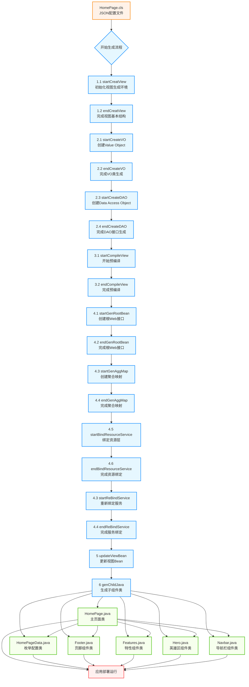

# OODER图转代码生成流程图

## 生成过程与交付物关系

## 生成流程说明

### 1. 设计输入

- **HomePage.cls**：JSON格式的前端配置文件，描述完整的组件树结构
- 包含组件的alias、key、path、properties等信息

### 2. 生成步骤

OODER的代码生成过程包含14个关键步骤，分为6个主要阶段：

#### 阶段1：视图创建 (1.1-1.2)
- 初始化视图生成环境
- 完成视图基本结构创建

#### 阶段2：数据层生成 (2.1-2.4)
- 创建Value Object（VO）类
- 创建Data Access Object（DAO）接口

#### 阶段3：预编译 (3.1-3.2)
- 编译视图配置
- 生成中间表示

#### 阶段4：Web接口生成 (4.1-4.4)
- 创建根Web接口
- 创建聚合映射

#### 阶段5：资源绑定 (4.5-4.6)
- 绑定资源层服务
- 重新绑定服务

#### 阶段6：视图更新与子组件生成 (5-6)
- 更新视图Bean
- 生成子组件Java类

### 3. 代码交付物

生成的Java代码交付物包括：

- **HomePage.java**：主页面类，包含核心注解
- **HomePageData.java**：枚举配置类，定义布局项
- **Footer.java**：页脚组件类
- **Features.java**：特性组件类
- **Hero.java**：英雄区组件类
- **Navbar.java**：导航栏组件类

### 4. 交付物依赖关系

- 主页面类（HomePage.java）依赖所有子组件类
- 枚举配置类（HomePageData.java）被主页面类引用
- 所有组件类最终用于应用部署运行

## 生成流程特点

1. **完整性**：从设计到部署的完整流程覆盖
2. **模块化**：清晰的阶段划分，便于维护和扩展
3. **自动化**：全流程自动化生成，减少人工干预
4. **一致性**：统一的配置源确保前后端一致性
5. **组件化**：生成的代码遵循组件化设计原则

## 技术优势

- **提高开发效率**：可视化设计大幅减少编码工作量
- **保证代码质量**：统一的生成规则确保代码质量
- **便于维护**：组件化设计便于后续修改和扩展
- **支持快速迭代**：设计变更可快速转换为代码变更

## 应用场景

- **企业级应用开发**：快速构建复杂应用系统
- **微服务架构**：支持生成微服务组件
- **跨平台开发**：可扩展支持多种后端语言
- **低代码开发平台**：作为核心技术支撑

这个流程图清晰地展示了OODER图转代码的完整生成过程和代码交付物之间的关系，有助于理解OODER"设计即代码"的核心理念和实现机制。